# IUT-Colmar-TPSupervision

## Introduction à la supervision réseau avec Zabbix

Dans un monde où les infrastructures télécoms et réseaux sont le socle de toute communication, **la supervision devient un pilier incontournable** pour garantir disponibilité, performance et sécurité. Les entreprises et opérateurs doivent anticiper les pannes, surveiller les ressources et réagir rapidement aux incidents pour maintenir un service optimal. **Zabbix**, solution open source de référence, répond à ces besoins en offrant une surveillance en temps réel des équipements, serveurs et applications, tout en générant des alertes proactives. Pour un futur ingénieur en télécoms et réseaux, maîtriser ces outils n’est pas seulement une compétence technique : c’est une exigence pour assurer la qualité de service et optimiser les infrastructures. Ce TP vous plongera au cœur de la supervision moderne, en vous permettant de comprendre, configurer et exploiter Zabbix dans un environnement professionnel.

## Pré-requis

* Docker
* Git ou download du dépôt https://github.com/grehm68/IUT-Colmar-TPSupervision

💡 Vscode peut-être pratique pour avoir un environnement complet. Et interpreter facilement le Markdown

## Ressources 

* Documentation officielle Zabbix : https://www.zabbix.com/documentation/current/en/manual ⚠️ Attention de bien être en version 7.4
* Dépôt https://github.com/grehm68/IUT-Colmar-TPSupervision
* Visualisation correct du Markdown https://github.com/grehm68/IUT-Colmar-TPSupervision/blob/main/README.md

## Notation du TP

L’évaluation de ce TP se base sur un rapport que vous constiturez au formation PDF (et uniquement dans ce format).

Ce rapport contiendra 2 parties :
* Le tableau récapitulatif ci-dessous avec les réponses (noté /10) 
* Un compte rendu de TP où vous expliquerez les différents étapes du TP. Vous mettrez des captures d'écrans de vos réalisations. (noté /8)

2 points seront attribués à la qualité du rapport et au respect des consignes.

4 points bonus seront attribués aux réalisations supplémentaires que vous pourrez réaliser en plus de ce qui est indiqué. (par ex : utilisation des Actions trigger, sur des webhook ou des scripts)

Vous devez fournir un rapport au format **PDF** (uniquement!) nommé de la sorte **NOM-Prénom-Rapport-Zabbix.pdf**

### Tableau récapitulatif (à intégrer directement au rapport en 1ère page)

|Question | Réponse (à ajouter) |
|:--------|:--------:|
|Liste des containers Zabbix démarrés avec la commande `docker ps` | |
|Screenshot de la 1ère connexion à Zabbix |                          |
|Résultat du ping depuis le serveur vers l'agent avec `zabbix_get`||
|Screenshot de la découverte du réseau zabbix ||
|Screenshot de 3 hôtes monitorés Monitoring / Hosts (avec le status Availability non grisé) ||
|Screenshot d'un graph (ou dashboard) de monitoring d'un hote en SNMP (interface eth0)  ||
|Screenshot du dashboard Fortnite ||
|Screenshot du problème + problème résolu (fichier manquant par ex) ||


## Liste de progression

- [ ] Démarrer tous les containers Zabbix sans erreur
- [ ] Connexion au portail web de zabbix
- [ ] Faire un ping depuis le serveur vers l'agent avec zabbix_get
- [ ] Faire une découverte du réseau zabbix
- [ ] Monitorer les machines trouvées avec les services associés
- [ ] Monitorer via SNMP
- [ ] Monitorer via API (🕹️Fortnite)
- [ ] Création de dashboard
- [ ] Création et correction de problèmes
- [ ] Envoyer les alertes sur un webhook (à faire)
- [ ] Execution d'un script (à faire)


## Architecture Zabbix 7.0 et vocabulaire

* **Zabbix Server (zabbix\_server) :**

  * Le cerveau. Écrit en Go (depuis la 7.0, anciennement en C).

  * **Rôles :**  
    * **Pollers :** Processus qui collectent les données (agents passifs, SNMP, JMX, IPMI).  
    * **Trappers :** Processus qui écoutent (sur le port 10051\) les données envoyées par les agents actifs ou les proxies.  
    * **History Syncer :** Écrit les données collectées dans la base de données.  
    * **Timer :** Gère le temps, les maintenances, les actions.  
    * **Alerters :** Gèrent l'envoi des notifications (email, scripts, webhooks).

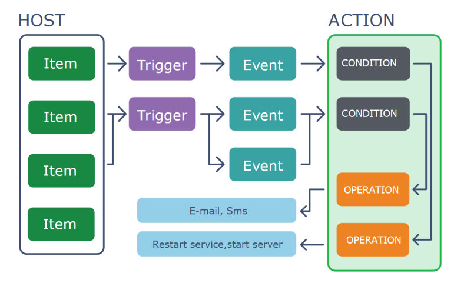

**Bonne Pratique :** Le serveur Zabbix ne doit faire *que* Zabbix. Ne pas installer d'autres services (serveur web, mail) dessus pour des raisons de performance.

* **Base de Données (PostgreSQL / TimescaleDB) :**  
  * Le cœur du stockage.  
  * **Stocke quoi ?**  
    * **Configuration :** Hôtes, Items, Triggers, Maps... (tout sauf l'historique).  
    * **Historique :** Les données brutes (ex: 15.2% CPU à 10:01).  
    * **Tendances :** Les données agrégées (moyenne par heure) pour garder une vision long terme sans saturer la base.

    

  **Bonne Pratique :** Utiliser **PostgreSQL** (recommandé) avec **TimescaleDB**. TimescaleDB est une extension qui optimise PostgreSQL pour les séries temporelles, résultant en des performances 10x à 100x supérieures pour les graphiques et le "housekeeping".


* **Frontend Web (Nginx \+ PHP) :**  
  * L'interface de configuration et de visualisation.  
  * Communique avec le Zabbix Server via l'API Zabbix et lit/écrit dans la base de données (pour la configuration).


* **Zabbix Agent (Agent) :**  
  * Le collecteur local sur les hôtes (Windows, Linux). Détaillé au Module 3\.


* **Zabbix Proxy (zabbix\_proxy) :**  
  * Un "mini" serveur Zabbix déporté. Il collecte les données de ses agents, les stocke localement (dans une base SQLite ou PostgreSQL), puis les envoie en *batch* au Zabbix Server principal.


  * **Cas d'usage (REX) :**


    * **Supervision distribuée :** Indispensable pour superviser des sites distants (agences bancaires, magasins) connectés par un WAN. Un proxy par site limite le trafic réseau à une seule connexion vers le central.

    

    * **Performance :** Si vous avez plus de 5 000 hôtes, le serveur Zabbix principal devient un goulot d'étranglement. On utilise des proxies pour répartir la charge de collecte, même s'ils sont dans le même datacenter.

    

    * **Réseaux isolés (DMZ) :** On place un proxy en DMZ pour collecter les données des serveurs publics. Le proxy est le seul à initier la connexion vers le Zabbix Server (en mode actif), gardant le flux DMZ \-\> LAN sécurisé et maîtrisé.


## Plan réseau du TP
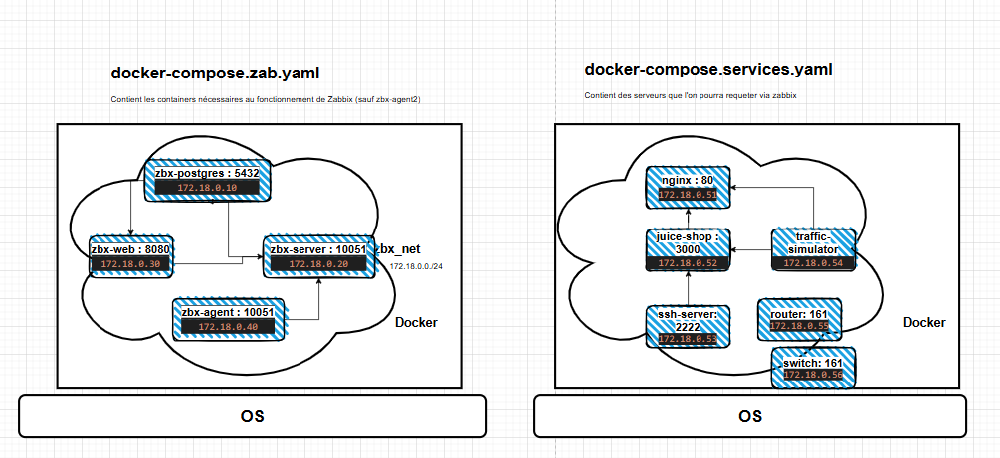


## Récupération de dépot

* Créer un répertoire de travail sur votre poste
* Récupérer le dépot ci-dessus, via git ou en le téléchargant directement

## Démarrage de l'environnement Zabbix

* Ouvrir un terminal et exécuter `docker -v`. Vérifier que le service Docker est bien démarré
* Assurez-vous qu'il n'y ait aucun containers qui tourne. La commande ne doit rien renvoyer. 
  ``` bash
  docker ps
  ```
* Si des containers sont démarrés, on stoppe les anciens containers éventuels
  ``` bash
  docker stop $(docker ps -a -q)
  ```
* Nettoyage des anciens containers sur les PC. ⚠️ Attention sur vos machines perso
  ``` bash
  docker system prune
  ```
* Démarrer les containers Zabbix en vous positionnant dans le répertoire précédent pour exécuter 

    ``` bash
    docker compose -f docker-compose.zab.yaml up -d
    ```
* Voir les containers démarrés : `docker ps`
* Voir les containers démarrés et leurs ports `docker ps -a --format "table {{.Names}}\t{{.Ports}}"` 
* Vous devez avoir 
  ``` bash
  zbx-web                          0.0.0.0:8080->8080/tcp, [::]:8080->8080/tcp
  zbx-server                       0.0.0.0:10051->10051/tcp, [::]:10051->10051/tcp
  zbx-postgres                     5432/tcp
  zbx-agent                        10050/tcp, 31999/tcp
  ```

## Se connecter sur le container zbx-web sur le port 8080
 * User : Admin (avec un A maj)
 * Password : zabbix

 Utilisation de `http://localhost:8080`

## Ping de l'agent depuis le serveur

### Se connecter à la console du serveur
Utiliser l'utilitaire docker ou 
``` bash
docker exec -it zbx-server /bin/bash
```

### Ping via Zabbix
Depuis le serveur :

```bash
zabbix_get -s IP_de_zbx-agent -k agent.ping
```

Résultat attendu :

```
1
```

Cela confirme que :

✔ L’agent répond
✔ Le port 10050 est ouvert
✔ Le hostname est correct
✔ Le serveur Zabbix communique avec l’agent

### Récupération de la version de l'agent
Depuis le serveur :

```bash
zabbix_get -s <IP_de_l_agent> -k agent.version
```

Résultat attendu :

```
7.4.x (7.4.5)
```

## Ajout Agent (version 1)
> **_NOTE:_** On ajoute l'hôte zbx-agent, en appliquant le template Linux servers

* Monitoring / Hosts / Create Host

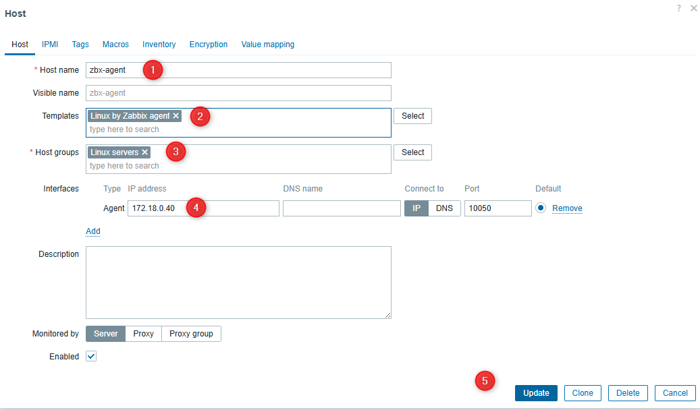

* Visualisation des graphs : Monitoring / Hosts / zbx-agent / Graphs

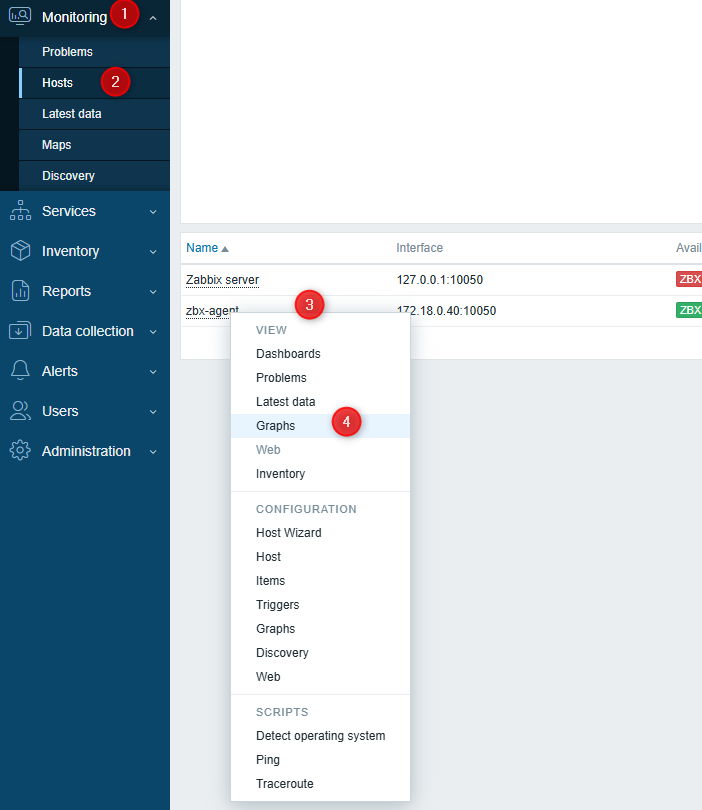

Vous devez avoir des graphiques après quelques secondes


## Discovery
> **_NOTE:_** On va utiliser la fonction de découverte Zabbix pour faire une découverte de l'infrastructure zabbix + des services.

* Utiliser les commandes docker pour récuperer l'adresse du réseau utilisé par les containers.
``` bash
  docker network ls
  docker network inspect {name}
```

* Aller dans le menu Discovery et renseigner au point 5 l'adresse de votre réseau zabbix
* Au point 7 renseigner les ports 
> [!TIP]
> On peut utiliser ICMP pour faire la découverte
  
> [!CAUTION]
> Renseigner les ports en fonction du schéma réseau (en + de ICMP)
  


## Utilisation de Zabbix agent2

### **🧠 Concept : Pourquoi passer à l'Agent 2 ?**

Avant de migrer, comprenons l'évolution.

* **Zabbix Agent (Legacy \- C) :** L'ancien standard. Léger et stable, mais limité.  
* **Zabbix Agent 2 (Moderne \- Go) :** C'est la nouvelle norme. Écrit en langage **Go**, il est beaucoup plus performant car il gère les vérifications en parallèle (un check lent ne bloque pas les autres). De plus, il supporte nativement des **plugins** (PostgreSQL, Docker, MongoDB) sans scripts complexes.

### **🧠 Concept : Passif vs Actif (Le choix crucial)**

* **Mode Passif (Serveur ➔ Agent) :** Le serveur demande "Quelle est ta CPU ?". L'agent répond. Simple, mais bloqué par le NAT.  
* **Mode Actif (Agent ➔ Serveur) :** L'agent contacte le serveur : *"Bonjour, donne-moi ma configuration"*. Le serveur envoie la liste des items. L'agent envoie ensuite les données de lui-même (Push).  
  * *Avantage :* Traverse les pare-feux/NAT et soulage le serveur Zabbix.  
  * *Bonne pratique :* Toujours privilégier le **mode Actif**.


### 🔌 Mode Passif ou Mode Actif ?

Pour l'Agent 2 (que ce soit sur Linux ou Windows), la recommandation est claire :

> **🏆 Le Mode ACTIF est le grand gagnant.**
>
> C'est la recommandation officielle pour 95% des infrastructures modernes, surtout avec Zabbix 7.4.

Voici pourquoi, expliqué simplement pour vos apprenants :

#### 1\. La raison n°1 : Les Pare-feux et le NAT

C'est l'argument décisif.

  * **Mode Passif** (Serveur ➔ Agent) :

      * Le serveur Zabbix essaie d'entrer chez le client (`Serveur -> Port 10050`).
      * 🔴 **Problème :** Si votre Windows ou Linux est derrière une Box Internet, un routeur NAT, ou dans le Cloud (AWS/Azure), ça bloque. Vous devez ouvrir des ports et faire du "Port Forwarding" partout.

  * **Mode Actif** (Agent ➔ Serveur) :

      * L'agent sort vers le serveur (`Agent -> Port 10051`).
      * 🟢 **Avantage :** La plupart des pare-feux autorisent le trafic sortant par défaut. **Ça marche immédiatement**, sans toucher au réseau.

#### 2\. La "Mémoire Tampon" (Buffer) - Vital \!

C'est une fonctionnalité exclusive au mode Actif.

  * **Scénario :** Votre connexion internet coupe pendant 1 heure.
  * **En Passif :** Le serveur n'a pas pu contacter l'agent. Il y a un "trou" dans les graphiques. La donnée est perdue à jamais.
  * **En Actif :** L'Agent 2 stocke les données en mémoire (Buffer). Dès que la connexion revient, il envoie tout l'historique d'un coup. **Aucune perte de données.**

#### 3\. La Performance (Scalabilité)

  * **En Passif :** Le serveur Zabbix doit gérer un chronomètre pour chaque hôte (*"Est-ce que c'est l'heure de demander la CPU à Windows ?"*). Si le réseau est lent, le serveur "attend" et ses processus s'engorgent.
  * **En Actif :** Le serveur envoie juste la liste des courses (la config) au début. Ensuite, c'est l'Agent qui gère son propre timing. Le serveur ne fait que "recevoir et stocker". C'est beaucoup plus léger pour le serveur Zabbix.

-----


### Installation zabbix agent2
> **_NOTE:_** On démarre plusieurs services (nginx, jice-shop, ssh-server) que l'on va pouvoir monitorer

* Démarrage des services à monitorer
  ``` bash
  docker compose -f docker-compose.services.yaml up -d
  ```

#### Installation de zabbix-agent2 sur l'hote nginx
  * Connexion au serveur nginx
    ``` bash
    docker exec -it nginx bash
    ```
  * Installation de l'agent zabbix-agent2
    ``` bash
    apt update && apt install zabbix-agent2
    ```
#### Configuration de l'agent 
  1. ⚠️ Pensez à faire un backup des fichiers de confs avant édition
  2. 💡 Utilisez votre éditeur favori, et si il n'existe pas il faut l'installer : ```apt install vim```
  3. ⚠️ Pour que le mode Actif fonctionne, il faut impérativement vérifier deux choses :

##### 1\. Côté Fichier de config (`/etc/zabbix/zabbix_agent2.conf`)

Vous devrez remplir le champ `ServerActive`. 

```ini
# Le mode Passif utilise ce champ
Server=<IP DU SERVEUR ZABBIX> #(ex: 172.18.0.20)

# Le mode Actif utilise OBLIGATOIREMENT ce champ (et le précédent - bug)
ServerActive=<IP DU SERVEUR ZABBIX> #(ex: 172.18.0.20)

# Indispensable en Actif : Le nom de l'agent doit être EXACTEMENT celui dans l'interface Web.
Hostname=nginx

# Permet à chaque démarrage de l'agent de calculer les métriques (optionnel)
ForceActiveChecksOnStart=1
```
⚠️ Il faut penser à redémarrer le service zabbix_agent2
``` bash
/etc/init.d/zabbix-agent2 restart
/etc/init.d/zabbix-agent2 status
```
💡 Dans le lab, la fonction restart n'arrive pas à killer le daemon `usr/sbin/zabbix_agent2`. Il faut tuer le process à la main, ou redémarrer le container
 ``` bash
    apt install procps  
    ps aux | grep zabbix
    kill -9 <ZABBIX-PID>    
    /etc/init.d/zabbix-agent2 start
    /etc/init.d/zabbix-agent2 status
  ```
  
* Vérification en cli du fonctionnement de l'agent
``` bash
zabbix_agent2 --print 
```
✅ On doit avoir des datas

#### 2\. Côté Interface Web (Templates)

C'est l'erreur classique des débutants. Si vous configurez l'agent en actif mais que vous appliquez un template passif, rien ne remontera.

  * ❌ **Ne prenez pas :** `Windows ou Linux by Zabbix agent` (Souvent passif par défaut).
  * ✅ **Prenez :** `Windows ou Linux by Zabbix agent **active**`.
  * ⚠️ Pour pouvoir sélectionner les templates, selectionnez `Templates` en `Template group`

> **📝 Résumé  :**
> "Pour vous simplifier la vie avec le réseau et ne pas perdre de données, configurez toujours vos serveurs en **Mode Actif** et choisissez les templates finissant par **'Active'**."

<!-- 😎 Les agents2 sont déjà installés sur certains hôtes. -->

   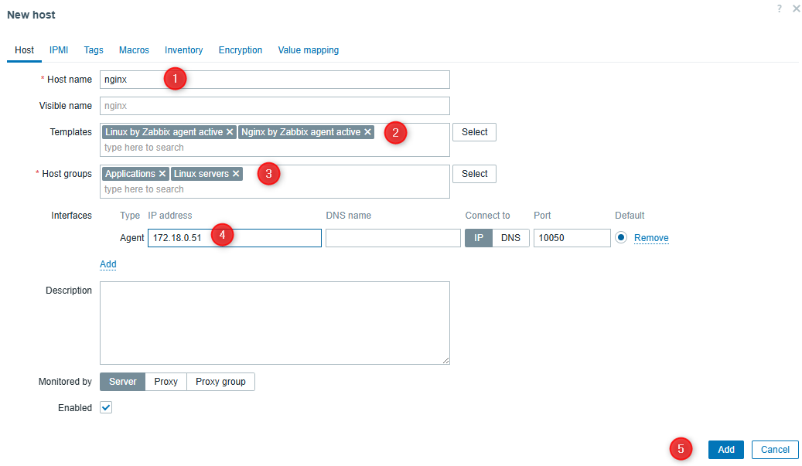

   Les actives checks doivent passer après quelques minutes

   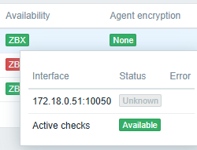

   💡 On peut aller voir les dashboard de l'hote, les problèmes remontés.

   Naviguez dans les items, les triggers et les graphs pour comprendre leurs liaisons

  ## Monitoring en SNMP

  1 router et 1 switch sont dispos en snmp (uniquement !)

  * Créer un hostgroup Networks

  * Créer 2 hotes en snmp (router et switch)
  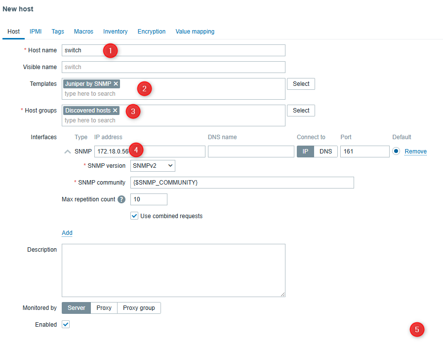

    * le router utilise un template snmp cisco
    * le switch utilise un template snmp juniper

  * Passer la communauté SNMP via les Macros (permet de changer les noms des communautés)
  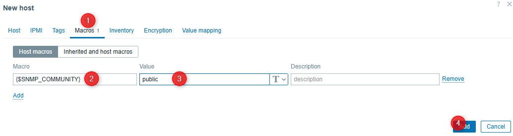

  * Afficher un graph sur les interfaces

## Monitoring Web
On peut facilement faire du monitoring de site web via `Web scenarios`

* Aller sur l'hôte Zabbix server (ou un autre) Monitoring / Hosts
* Choisir Configuration / Web
* Choisir **Create web scenario**
* Mettre un nom et laisser les valeurs par défaut
* Aller dans **Steps** et rajouter l'URL à tester. ⚠️ Les Urls internes ne fonctionnent pas dans la maquette. Utiliser une résolution DNS externe (type www.google.fr)

* Pour visualiser le réponse il faut aller dans **Monitoring / Hosts** et aller dans la colonne `Web` sur la droite


## Intégration d'API

### Récupéreration des états de Fortnite et intégration dans Zabbix

#### Création d'un item 
 
 On associera cet item à un hote déjà existant (zabbix server par ex)

 Allez dans **Data Collection / Hosts / Selectionner l'hote / items** puis **Create Item** (en haut à droite)

    Name : Choisissez le nom que vous voulez, mais mettez Fortnite dedans
    Type : HTTP Agent
    Key : fortnite.status
    URL : https://status.epicgames.com/api/v2/summary.json
    Request Method : GET
    Laisser les autres valeurs par défaut

  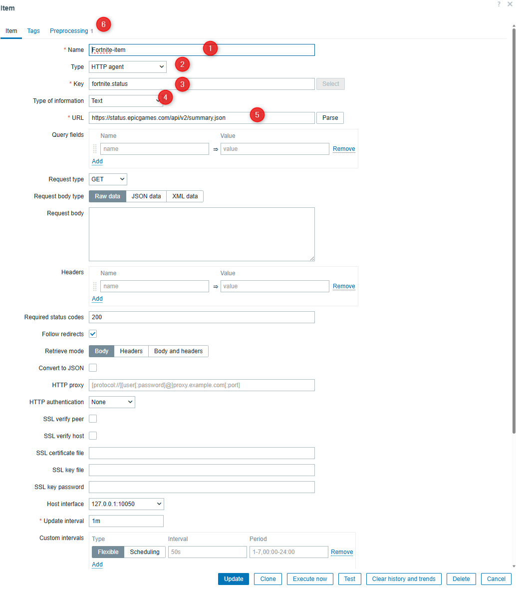

  Allez dans l'onglet **Preprocessing**

  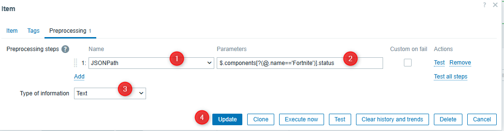
  
  Ajouter un **Preprocessing Step** :

  **Type** : JSONPath
  
  **Expression** : `$.components[?(@.name=='Fortnite')].status`

  **Type of information** : text

#### Test de l'item

 * Lancement du test

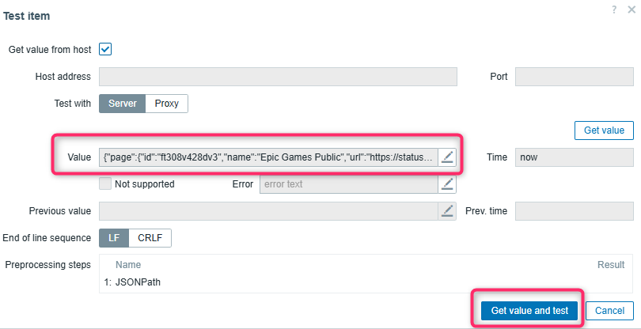

* Visualisation du test

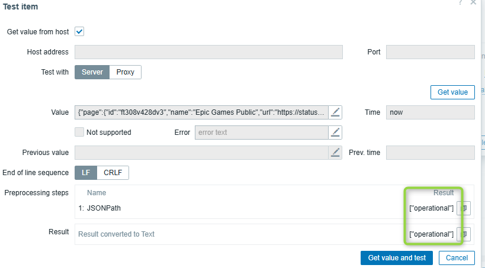


  * Aller dans Monitoring / Latest Data / 
  * Cliquer sur le nom et Selectionner **Values** pour voir les valeurs récupérées

* Créer un trigger pour déclancher une alerte en fonction du status <> operational
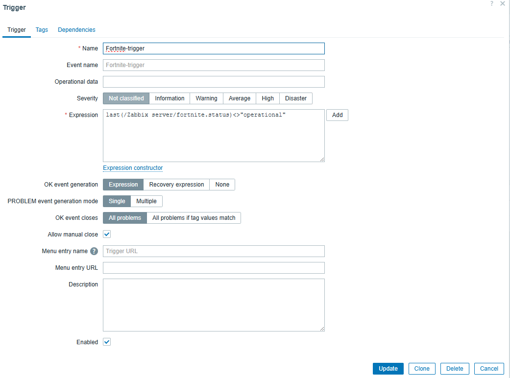

## Création de Dashboard

### Visualisation des dashboards déjà présent

Aller dans Dashboard pour visusaliser les dashboard déjà présents. N'hésitez pas à naviguer dans les dashboard du serveurs et d'autres.

Vous pouvez également retrouver les dashboard via le menu Monitoring / Hosts / Dashboard.

Ajoutez dans votre rapport des dashboard de type `graph`, `pie`,
### Widget n°1 – Liste des Problèmes Actifs

Ce widget représente la « to-do list » opérationnelle en temps réel.

1. Cliquer sur **Add widget**.
2. **Type :** `Problems`.
3. **Name :** `🔥 Alertes en cours`.
4. **Show :** `Recent problems`

   > Affiche les problèmes actifs ainsi que ceux résolus récemment pour suivi.
5. **Show tags :** `1`

   > Affiche la première colonne de tags (utile pour la répartition par équipe).
6. **Show operational data :** `Separately`

   > Présente la valeur actuelle (ex. « 93 % used ») dans une colonne dédiée.
7. **Advanced filter (facultatif) :**

   * Tag name : `Team`
   * Tag value : `SysAdmin`
8. Cliquer sur **Add**.

### Créer un dashboard
Créez votre propre dashboard en vous basant sur les hôtes disponibles. 

N'hésitez pas à être créatif

### Création de dashboard réseau
Utilisez les hotes router et switch pour faire des visualisation de réseaux

### Création de dashboard Fortnite

* Aller dans Dashboard / Create Dashboard

* Add widget type HoneyComb
* Dans **Item-Patterns** choisir votre item Fornite créé précédemment
* Save changes

### Création de problèmes

#### 🌟 Monitor l'existance d'un fichier avec Zabbix 🌟

📌 Création d'un Item Key:
`vfs.file.exists["/tmp/iut.txt"]`

📌 Création d'un Trigger Expression:
`last(/hostname/vfs.file.exists[/tmp/iut.txt])=0`

🚀 Pourquoi c'est important :
* Processus ininterrompus : Garantir que les fichiers critiques restent toujours accessibles.
* Intégrité des données : Réduire au minimum le risque de perte ou de déplacement des données.
* Réactivité : Détecter instantanément les fichiers manquants et agir rapidement.

## Intégration WebHook Discord
 * Avoir un serveur Discord ouvert
 * Activer le template Discord dans **Media Types**
 * Créer un media type Discord de type webhook
 * Dans Alerts / Actions / Trigger Actions, activer le Report problems to Zabbix administrators

 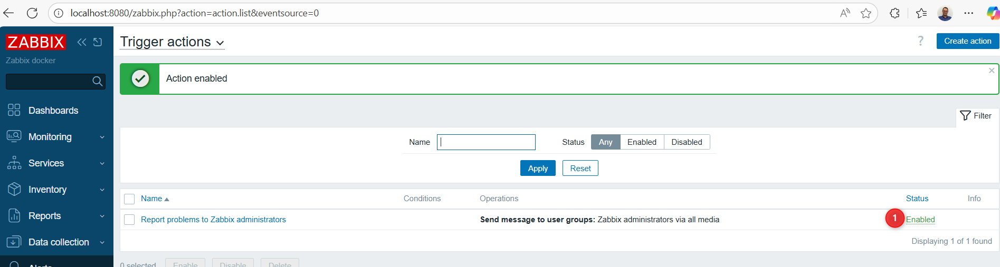

 ## Idées pour aller plus loin
* UserParameter, créer ses propres datas
* Scan de vuln avec trivy

## TIPS

* Démarrer les containers via un compose file 
``` bash
docker compose -f docker-compose.zab.yaml up -d
```

* Connexion à un système docker en bash
``` bash
docker exec -it <name> bash
```
* Connexion en root
``` bash
docker exec -it --user root <name> bash
```

* Docker cheat sheet https://blog.stephane-robert.info/docs/conteneurs/moteurs-conteneurs/docker/cheat-sheet/

* Lister les réseaux docker
``` bash
docker network ls
```
* Voir les ip d'un réseau
``` bash
docker network inspect {name}
```

* Voir les ports en écoutes avec netstat
``` bash
apt install net-tools
netstat 
```

* Installer PS pour voir les processus
``` bash
apt install procps      
```

* Doc docker_snmp_simulator https://github.com/Antoine-O/docker_snmp_simulator/blob/master/Readme.md

* Nettoyage des containers à la fin du TP
``` bash
docler system prune
```