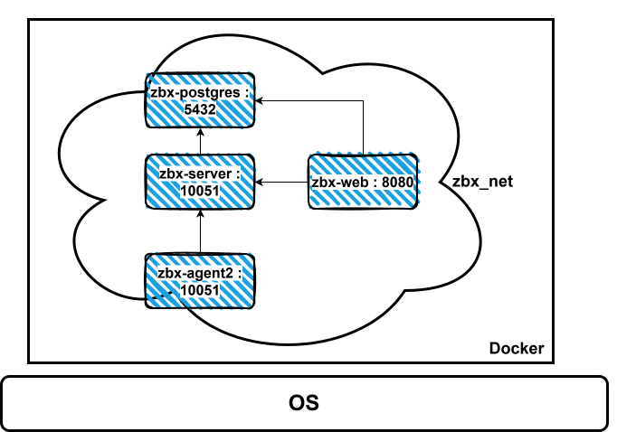
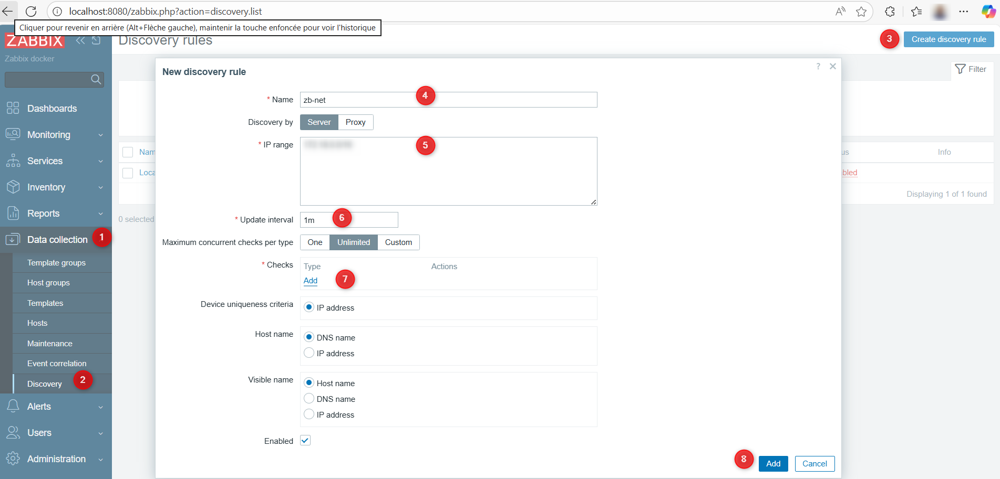

# IUT-Colmar-TPSupervision

## Startup ENV PROF

``` bash
docker compose -f docker-compose.services.yaml up -d
```
## Startup ENV ETU

``` bash
docker compose -f docker-compose.zab.yaml up -d
```
Démarrer tous les containers
## Progress List

- [ ] Démarrer tous les containers Zabbix sans erreur
- [ ] Connexion au portail web de zabbix
- [ ] Faire un ping depuis le serveur vers l'agent avec zabbix_get
- [ ] Faire une découverte du réseau zabbix
- [ ] Faire une découverte du réseau prof (icmp, web, snmp)
- [ ] Monitorer les machines trouvées avec les services associés
- [ ] Monitorer SNMP
- [ ] Monitorer les vulnérabilités du server xxx
- [ ] Envoyer les alertes sur un webhook

## Architecture Zabbix en containers


## Se connecter sur le container zbx-web sur le port 8080
 * User : Admin (avec un A maj)
 * Password : zabbix

 Utilisation de `http://localhost:8080`

## Ping de l'agent depuis le serveur

### Se connecter à la console du serveur
Utiliser l'utilitaire docker ou 
``` bash
docker exec -it zbx-server /bin/bash
```

### Ping via Zabbix
Depuis le serveur :

```bash
zabbix_get -s IP_de_zbx-agent2 -k agent.ping
```

Résultat attendu :

```
1
```

Cela confirme que :

✔ L’agent répond
✔ Le port 10050 est ouvert
✔ Le hostname est correct
✔ Le serveur Zabbix communique avec l’agent

### Récupération de la version de l'agent
Depuis le serveur :

```bash
zabbix_get -s <IP_de_l_agent> -k agent.version
```

Résultat attendu :

```
7.4.x (7.4.5)
```

 ## Ajout Agent (version 1)
 > **_NOTE:_** On ajoute l'hôte zbx-agent, en appliquant le template Linux servers
 * Monitoring / Hosts / Create Host
 

 * Visualisation des graphs : Monitoring / Hosts / zbx-agent / Graphs
 

 Vous devez avoir des graphiques après quelques secondes


 ## Discovery
 > **_NOTE:_** On va utiliser la fonction de découverte Zabbix pour faire une découverte de l'infrastructure zabbix (sur votre poste) + de l'infrastructure du prof (distante).
  * Utiliser les commandes docker pour récuperer l'adresse du réseau utilisé par les containers.
  ``` bash
  docker network ls
  docker network inspect {name}
  ```
  * Aller dans le menu Discovery et renseigner au point 5 l'adresse de votre réseau zabbix + l'adresse du réseau du prof
  * Au point 7 renseigner les ports 
  > [!TIP]
  > On peut utiliser ICMP pour faire la découverte
  
  > [!CAUTION]
  > Renseigner les ports
  
  

## Utilisation de Zabbix agent2

### **🧠 Concept : Pourquoi passer à l'Agent 2 ?**

Avant de migrer, comprenons l'évolution.

* **Zabbix Agent (Legacy \- C) :** L'ancien standard. Léger et stable, mais limité.  
* **Zabbix Agent 2 (Moderne \- Go) :** C'est la nouvelle norme. Écrit en langage **Go**, il est beaucoup plus performant car il gère les vérifications en parallèle (un check lent ne bloque pas les autres). De plus, il supporte nativement des **plugins** (PostgreSQL, Docker, MongoDB) sans scripts complexes.

### **🧠 Concept : Passif vs Actif (Le choix crucial)**

* **Mode Passif (Serveur ➔ Agent) :** Le serveur demande "Quelle est ta CPU ?". L'agent répond. Simple, mais bloqué par le NAT.  
* **Mode Actif (Agent ➔ Serveur) :** L'agent contacte le serveur : *"Bonjour, donne-moi ma configuration"*. Le serveur envoie la liste des items. L'agent envoie ensuite les données de lui-même (Push).  
  * *Avantage :* Traverse les pare-feux/NAT et soulage le serveur Zabbix.  
  * *Bonne pratique :* Toujours privilégier le **mode Actif**.


### 🔌 Mode Passif ou Mode Actif ?

Pour l'Agent 2 (que ce soit sur Linux ou Windows), la recommandation est claire :

> **🏆 Le Mode ACTIF est le grand gagnant.**
>
> C'est la recommandation officielle pour 95% des infrastructures modernes, surtout avec Zabbix 7.4.

Voici pourquoi, expliqué simplement pour vos apprenants :

#### 1\. La raison n°1 : Les Pare-feux et le NAT

C'est l'argument décisif.

  * **Mode Passif** (Serveur ➔ Agent) :

      * Le serveur Zabbix essaie d'entrer chez le client (`Serveur -> Port 10050`).
      * 🔴 **Problème :** Si votre Windows ou Linux est derrière une Box Internet, un routeur NAT, ou dans le Cloud (AWS/Azure), ça bloque. Vous devez ouvrir des ports et faire du "Port Forwarding" partout.

  * **Mode Actif** (Agent ➔ Serveur) :

      * L'agent sort vers le serveur (`Agent -> Port 10051`).
      * 🟢 **Avantage :** La plupart des pare-feux autorisent le trafic sortant par défaut. **Ça marche immédiatement**, sans toucher au réseau.

#### 2\. La "Mémoire Tampon" (Buffer) - Vital \!

C'est une fonctionnalité exclusive au mode Actif.

  * **Scénario :** Votre connexion internet coupe pendant 1 heure.
  * **En Passif :** Le serveur n'a pas pu contacter l'agent. Il y a un "trou" dans les graphiques. La donnée est perdue à jamais.
  * **En Actif :** L'Agent 2 stocke les données en mémoire (Buffer). Dès que la connexion revient, il envoie tout l'historique d'un coup. **Aucune perte de données.**

#### 3\. La Performance (Scalabilité)

  * **En Passif :** Le serveur Zabbix doit gérer un chronomètre pour chaque hôte (*"Est-ce que c'est l'heure de demander la CPU à Windows ?"*). Si le réseau est lent, le serveur "attend" et ses processus s'engorgent.
  * **En Actif :** Le serveur envoie juste la liste des courses (la config) au début. Ensuite, c'est l'Agent qui gère son propre timing. Le serveur ne fait que "recevoir et stocker". C'est beaucoup plus léger pour le serveur Zabbix.

-----


### Installation zabbix agent2 (sur pc prof)
> **_NOTE:_** On démarre plusieurs services (nginx, jice-shop, ssh-server) que l'on va pouvoir monitorer

* Démarrage des services à monitorer (dans le réseau `lab_network` `172.20.0.0/24` )
  ``` bash
  docker compose -f docker-compose.services.yaml up -d
  ```

#### Installation de zabbix-agent2 sur l'hote nginx
  * Connexion au serveur nginx
    ``` bash
    docker exec -it nginx bash
    ```
  * Installation de l'agent zabbix-agent2
    ``` bash
    apt update && apt install zabbix-agent2
    ```
#### Configuration de l'agent 
  1. ⚠️ Pensez à faire un backup des fichiers de confs avant édition
  2. 💡 Utilisez votre éditeur favori, et si il n'existe pas il faut l'installer : ```apt install vim```
  3. ⚠️ Pour que le mode Actif fonctionne, il faut impérativement vérifier deux choses :

##### 1\. Côté Fichier de config (`/etc/zabbix/zabbix_agent2.conf`)

Vous devrez remplir le champ `ServerActive`. 

```ini
# Le mode Passif utilise ce champ
Server=<IP DU SERVEUR ZABBIX> #(ex: 172.18.0.20)

# Le mode Actif utilise OBLIGATOIREMENT ce champ (et le précédent - bug)
ServerActive=<IP DU SERVEUR ZABBIX> #(ex: 172.18.0.20)

# Indispensable en Actif : Le nom de l'agent doit être EXACTEMENT celui dans l'interface Web.
Hostname=nginx

# Permet à chaque démarrage de l'agent de calculer les métriques (optionnel)
ForceActiveChecksOnStart=1
```
⚠️ Il faut penser à redémarrer le service zabbix_agent2
``` bash
/etc/init.d/zabbix-agent2 restart
/etc/init.d/zabbix-agent2 status
```
💡 Dans le lab, la fonction restart n'arrive pas à killer le daemon `usr/sbin/zabbix_agent2`. Il faut tuer le process à la main, ou redémarrer le container
 ``` bash
    apt install procps  
    ps aux | grep zabbix
    kill -9 <ZABBIX-PID>    
    /etc/init.d/zabbix-agent2 start
    /etc/init.d/zabbix-agent2 status
  ```
  
* Vérification en cli du fonctionnement de l'agent
``` bash
zabbix_agent2 --print 
```
✅ On doit avoir des datas

#### 2\. Côté Interface Web (Templates)

C'est l'erreur classique des débutants. Si vous configurez l'agent en actif mais que vous appliquez un template passif, rien ne remontera.

  * ❌ **Ne prenez pas :** `Windows ou Linux by Zabbix agent` (Souvent passif par défaut).
  * ✅ **Prenez :** `Windows ou Linux by Zabbix agent **active**`.
  * ⚠️ Pour pouvoir sélectionner les templates, selectionnez `Templates` en `Template group`

> **📝 Résumé  :**
> "Pour vous simplifier la vie avec le réseau et ne pas perdre de données, configurez toujours vos serveurs en **Mode Actif** et choisissez les templates finissant par **'Active'**."

<!-- 😎 Les agents2 sont déjà installés sur certains hôtes. -->

   

   Les actives checks doivent passer après quelques minutes
   

   💡 On peut aller voir les dashboard de l'hote, les problèmes remontés.

   Naviguez dans les items, les triggers et les graphs pour comprendre leurs liaisons

  ## SNMP
   

  ## TIPS
  **Liste des containers**
  * zbx-web
  * zbx-server
  * zbx-postgres

  ### DOCKER TIPS
   * Connexion à un système docker en bash
   ``` bash
   docker exec -it <name> bash
   ```
   * Connexion en root
   ``` bash
   
   ```
   https://blog.stephane-robert.info/docs/conteneurs/moteurs-conteneurs/docker/cheat-sheet/

   * Lister un réseau
   ``` bash
  docker network ls
  ```
   * Voir les ip d'un réseau
   ``` bash
  docker network inspect {name}
  ```

   ### ENV PROF TIPS
   * Connexion du server Zabbix au lab_network
   ``` bash
   docker network connect lab_network zbx-server
   ```

    * Voir les ports en écoutes avec netstat
    ``` bash
    apt install net-tools
    netstat 

    * Installer PS pour voir les processus
    ``` bash
    apt install procps      
    ```